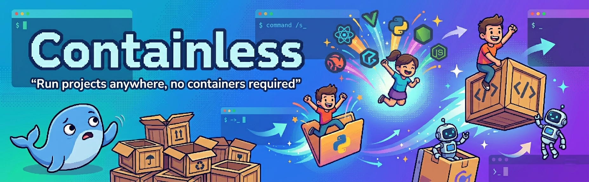

<div align="center">



# Containless

**Docker-like runtime isolation — without the container.**

Install and run Node.js, Python, Java, and Go locally inside your project folder, completely isolated from global installs.

[](https://www.npmjs.com/package/containless)
[](https://github.com/user/containless/blob/main/LICENSE)
[](https://nodejs.org)

</div>

---

## Why Containless?

Ever had a project that needs Node 18 while another needs Node 20? Or a Python project that conflicts with your system Python? **Containless** solves this by downloading runtimes directly into your project folder — no global installs, no version managers, no containers.

- 🎯 **Project-level isolation** — each project gets its own runtime
- 🚫 **Zero global pollution** — never touches your system PATH
- 📦 **Self-contained** — everything lives in `.containless/`
- ⚡ **Blazing fast** — cached downloads, no container overhead
- 🔒 **Reproducible** — lock runtime versions in `containless.json`

## Installation

```bash
# Install globally
npm install -g containless

# Or use directly with npx
npx containless
```

## Quick Start

1. Run your project:

```bash
containless run
```

That's it! Containless will **automatically scan** your project for config files (like `package.json`, `go.mod`, `pyproject.toml`, `pom.xml`, etc.), detect the required runtimes and versions, generate a `containless.json`, download the runtimes into `.containless/runtimes/`, and execute your start command — all in one step.

> **Note:** You can also run `containless init` first to preview what was detected before running.

### What gets detected?

| Runtime    | Files Scanned                                              |
| ---------- | ---------------------------------------------------------- |
| **Node.js**| `.nvmrc`, `.node-version`, `package.json` (engines)        |
| **Python** | `.python-version`, `pyproject.toml`, `requirements.txt`, `setup.py` |
| **Go**     | `go.mod`                                                   |
| **Java**   | `.java-version`, `pom.xml`, `build.gradle`, `build.gradle.kts` |

### Manual setup (optional)

You can still create a `containless.json` manually if you prefer:

```json
{
  "runtime": {
    "node": "18.17.0"
  },
  "start": "npm run dev"
}
```

## Commands

### `containless run`

Ensures all runtimes are installed locally, then executes the `start` command. If no `containless.json` exists, it will **auto-scan** your project and generate one.

```bash
containless run
```

### `containless init`

Scan your project and generate a `containless.json` config file. Shows a table of what was detected and from which files.

```bash
# Scan and generate containless.json
containless init

# Overwrite an existing containless.json
containless init --force
```

### `containless install <runtime@version>`

Download and install a specific runtime into `.containless/runtimes/`.

```bash
containless install node@18.17.0
containless install python@3.11.0
containless install java@21
containless install go@1.21.0
```

### `containless clean`

Delete all locally installed runtimes.

```bash
# Remove runtimes only
containless clean

# Remove everything (runtimes + cache)
containless clean --all
```

### `containless info`

Show a table of all locally installed runtimes with version and binary path.

```bash
containless info
```

Example output:
```
┌─────────┬─────────┬────────────────────────────────────────────────┬──────────┐
│ Runtime │ Version │ Binary Path                                    │ Status   │
├─────────┼─────────┼────────────────────────────────────────────────┼──────────┤
│ node    │ 18.17.0 │ .containless/runtimes/node-18.17.0/bin/node   │ ✔ ready  │
│ python  │ 3.11.0  │ .containless/runtimes/python-3.11.0/bin/python│ ✔ ready  │
└─────────┴─────────┴────────────────────────────────────────────────┴──────────┘
```

## Configuration

### `containless.json`

| Field     | Type                      | Description                                    |
| --------- | ------------------------- | ---------------------------------------------- |
| `runtime` | `Record<string, string>`  | Map of runtime names to version strings        |
| `start`   | `string`                  | Command to run when executing `containless run` |

#### Full example

```json
{
  "runtime": {
    "node": "18.17.0",
    "python": "3.11.0",
    "java": "21",
    "go": "1.21.0"
  },
  "start": "npm run dev"
}
```

## Supported Runtimes

| Runtime    | Source                                | Platforms                             |
| ---------- | ------------------------------------- | ------------------------------------- |
| **Node.js**| [nodejs.org](https://nodejs.org)      | linux-x64, darwin-x64, darwin-arm64, win32-x64 |
| **Python** | [python-build-standalone](https://github.com/indygreg/python-build-standalone) | linux-x64, linux-arm64, darwin-x64, darwin-arm64, win32-x64 |
| **Java**   | [Adoptium](https://adoptium.net)      | linux-x64, linux-arm64, darwin-x64, darwin-arm64, win32-x64 |
| **Go**     | [go.dev](https://go.dev)              | linux-x64, linux-arm64, darwin-x64, darwin-arm64, win32-x64 |

## How It Works

1. **Download** — Runtime archives are fetched from official sources
2. **Cache** — Archives are stored in `.containless/cache/` to avoid re-downloading
3. **Extract** — Runtimes are extracted to `.containless/runtimes/<name>-<version>/`
4. **Inject** — When running commands, the local runtime's `bin/` directory is prepended to `PATH`
5. **Isolate** — Your command runs with the local runtime, completely ignoring global installs

```
your-project/
├── containless.json
├── .containless/
│   ├── cache/                    ← downloaded archives
│   └── runtimes/
│       ├── node-18.17.0/         ← extracted Node.js
│       │   └── bin/node
│       └── python-3.11.0/        ← extracted Python
│           └── bin/python3
├── src/
└── package.json
```

## .gitignore

Add `.containless/` to your `.gitignore` — runtime binaries should not be committed:

```gitignore
.containless/
```

Containless will warn you if this entry is missing.

## Roadmap

Curious about what's next? Check out the [ROADMAP.md](./ROADMAP.md) for future planned features like broader runtime support, shell hooks, and intelligent lockfile parsing.

## Contributing

See [CONTRIBUTING.md](./CONTRIBUTING.md) for development setup, build instructions, and how to submit pull requests.

## License

[MIT](./LICENSE) © Anghelo Dearroz
